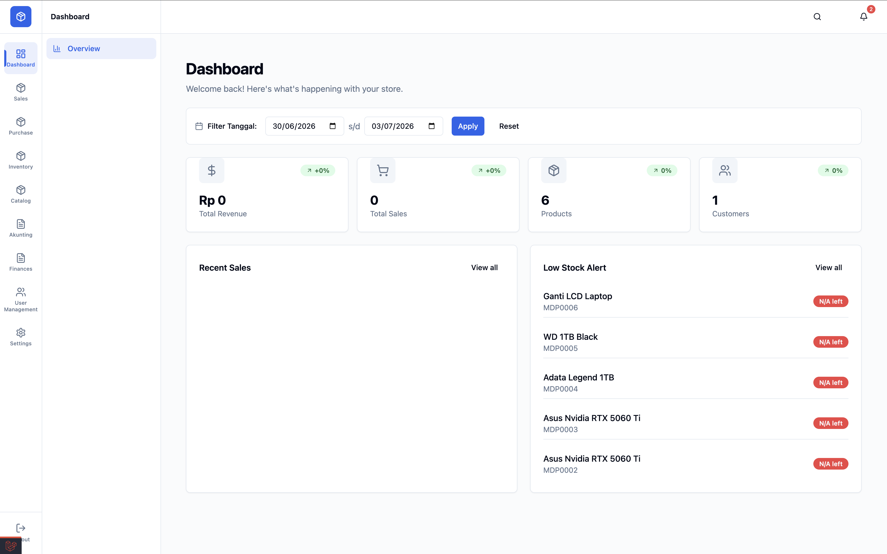

<p align="center">
  
  
  
  
</p>

# Hook ERP Inventory hook



## 📖 1. Application Description

**Hook POS Inventory Software** is a modern, all-in-one Point of Sale (POS), Accounting, and Business Management system built specifically for coffee shops and retail businesses. Powered by Laravel, Filament, and Inertia.js (Vue 3), it provides a blazing fast, reactive user interface for daily operations.

### ✨ Key Features:
- ☕ **POS Cashier** - Fast and seamless transactions.
- 📦 **Inventory Management** - Neatly manage product stock, variations, and warehouses.
- 👥 **HR & Employees** - Integrated attendance tracking, payroll, and task management.
- 💰 **Accounting** - Automated profit & loss and balance sheet reports.
- 🔧 **Services & Repairs** - Schedule and track item repairs.
- 📱 **Mobile Friendly** - Accessible from smartphones, tablets, and desktop devices.

---

## 🚀 2. How to Deploy

The application is fully containerized using Docker, making deployment to a production server straightforward.

1. **Clone the repository** to your production server:
   ```bash
   git clone <repository-url>
   cd hook
   ```

2. **Configure Environment:**
   ```bash
   cp .env.example .env
   # Edit .env with your production database, Redis, and APP_URL settings
   # e.g., APP_URL=https://yourdomain.com
   ```

3. **Start Docker Containers:**
   ```bash
   docker compose up -d
   ```

4. **Install Dependencies & Migrate (inside the container):**
   ```bash
   docker compose exec app composer install --optimize-autoloader --no-dev
   docker compose exec app php artisan key:generate
   docker compose exec app php artisan migrate --force
   ```

5. **Build Frontend Assets:**
   ```bash
   npm install
   npm run build
   ```

6. **Optimize Configuration:**
   ```bash
   docker compose exec app php artisan optimize
   ```

---

## 💻 3. How to Run (Local Development)

To run the application locally for development:

1. **Clone the repository:**
   ```bash
   git clone <repository-url>
   cd hook
   ```

2. **Start Docker Services:**
   This will spin up Nginx, PHP-FPM, MySQL, Redis, and the Queue worker.
   ```bash
   docker compose up -d
   ```

3. **Setup Laravel:**
   ```bash
   docker compose exec app bash -c "cp .env.example .env && composer install && php artisan key:generate && php artisan migrate"
   ```

4. **Install Node Modules & Run Dev Server (On Host):**
   ```bash
   npm install
   npm run dev
   ```

5. **Access the Application:**
   Open your browser and navigate to `http://localhost:8080`.
   Log in with the generated admin credentials, and you will be redirected to the Vue-based dashboard at `/app/dashboard`.

---

## 🏗️ 4. Structure

The project follows a standard Laravel directory structure with dedicated spaces for the Filament admin panel and the Vue 3 Inertia frontend.

```text
├── app/
│   ├── Filament/          # Filament Admin resources and pages
│   ├── Http/Controllers/  # Laravel Controllers (API & App logic)
│   ├── Models/            # Eloquent ORM Models
│   └── Services/          # Business logic and external services
├── bootstrap/             # Laravel bootstrap files
├── config/                # Application configurations
├── database/              # Migrations, seeders, and factories
├── docker/                # Docker configuration files (e.g., Nginx config)
├── public/                # Publicly accessible files and compiled assets
├── resources/
│   ├── css/               # Tailwind CSS entry points
│   ├── js/
│   │   ├── components/    # Reusable Vue 3 components (shadcn/ui, etc.)
│   │   ├── layout/        # Vue layouts
│   │   └── pages/         # Inertia.js Vue pages (/app/*)
│   └── views/             # Blade templates (e.g., app.blade.php)
├── routes/                # Web, API, and Console routes
└── tests/                 # Unit and Feature tests (Pest PHP)
```

---

## 🛠️ 5. Dependencies

### Backend
- **PHP** `^8.2` (Running on `8.4` in Docker)
- **Laravel** `^12.0`
- **Filament** `^3.3` (Admin Panel)
- **Inertia.js** `^2.0` (Laravel adapter)

### Frontend
- **Vue.js** `^3.5.13`
- **Tailwind CSS** `^3.4.18`
- **Inertia.js** `@inertiajs/vue3`
- **shadcn/ui** components (Radix Vue / Lucide Icons)
- **Vite** `^6.0`

### Infrastructure
- **Docker & Docker Compose**
- **MySQL** `8.0`
- **Redis** `7-alpine`
- **Nginx** `alpine`

---

## 📋 6. Version Note Changelog

Here is the history of application updates from the latest to the oldest:

### 🏗️ Version 1.8.0 - April 29 - May 9, 2026
**Inertia Vue Migration & Improvements**
- 🔧 Globalization of `RelationSelect` component (reusable select/search).
- 👤 Add new supplier directly from the Purchasing form (popup modal).
- 🗺️ Cascading dropdown for Province/City/District (Indonesia API).
- 🔔 API endpoint for Indonesian locations (provinces, cities, districts).
- 🛡️ Roles & Permission management in Vue.
- 👥 New User Management page.
- 📦 Inventory improvements & stabilization.

### 📦 Version 1.7.0 - April 24-28, 2026
**Inventory & Transactions**
- 📦 Unified Inventory Management page (Stock visualization & valuation).
- 🔀 Categorization filters for Physical Products and Services.
- 🛠️ Stabilization of Transaction modules (Sales & Purchases).
- 🧭 Navigation Bar structure updates.
- 🛡️ Stock data integrity audit and fixes.

### 🐛 Version 1.6.0 - April 10-23, 2026
**Polishing & Bug Fixes**
- 🔧 Fixes for product modals and popups.
- 🔍 Improved Brand and Category searchability.
- 📷 More stable photo uploads.
- 💾 Local storage for user preferences.
- 🎯 Form UI improvements.
- 🚀 Application performance optimization.
- 🐛 Various minor bug fixes.

### ⚡ Version 1.5.0 - April 2-6, 2026
**Migration to Inertia.js**
- 🚀 Migrated from Livewire to Inertia.js + Vue.js.
- ⚡ Faster performance and navigation.
- 🎯 Real-time dashboard data.
- 🧩 Efficient reusable components.
- 📦 More responsive Transactions (Sales & Purchases).

### 📅 Version 1.4.0 - February 19-26, 2026
**Calendar & Content**
- 📅 Content/marketing calendar.
- 📝 Promotional content management.
- 📅 Calendar and task integration.
- 🎨 Interactive calendar UI.

### 📲 Version 1.3.0 - February 1-17, 2026
**PWA & Deployment**
- 📱 PWA icons and splash screens.
- 🔧 Docker configuration for deployment.
- 🚀 Automated deployment scripts.
- 🔧 Nginx and SSL fixes.
- 🛡️ God Mode for super admin access.
- ⚙️ Database Export/Import functionality.

### ✨ Version 1.2.0 - January 20-31, 2026
**UI/UX Improvements**
- 🎨 Modern UI overhaul.
- 🖼️ WebP image format for better performance.
- 🗺️ Map picker for warehouse locations.
- 🎭 Cooler user avatars.
- 🔍 Global search for quick navigation.
- 🎨 Soft, eye-friendly color palettes.
- 🌙 Dark mode support.

### 🔄 Version 1.1.0 - January 15-17, 2026
**Trade-in Feature**
- 🔄 Trade-in product transactions.
- 💰 Automatic trade-in price calculation.
- 📊 Payment status tracking (Down Payment, Paid, etc.).
- 🎨 Simple and intuitive UI.

### 📄 Version 1.0.0 - January 13-16, 2026
**Invoices & Notifications**
- 📧 Email invoices to customers.
- 🧾 Simple and detailed invoices.
- 📱 QR Codes on invoices.
- 🔔 Centralized notification system.
- ✏️ Attendance edit feature for super admins.
- 📬 Automated notification email forwarder.

### 🔧 Version 0.9.0 - January 6-23, 2026
**Service & Task Management**
- 🔧 Scheduling for services/repairs.
- 📋 Daily Task system for employees.
- 💬 Comment system on tasks.
- 🔔 Task notifications with sound.
- 📎 File attachments on tasks.
- 📷 Service photo uploads.

### 📊 Version 0.8.0 - December 15-31, 2025
**Reports & Exports**
- 📄 Export reports to Excel.
- 📄 Export reports to PDF.
- 🖨️ Direct report printing.
- 📈 Dashboard with interactive widgets.
- 🌤️ Weather widget.
- 🔌 Laravel PWA (Progressive Web App) integration.
- 📱 Mobile-friendly views.

### 💰 Version 0.7.0 - December 7-15, 2025
**Accounting System**
- 📒 Account Types and Account Codes.
- 📥 Financial Transaction inputs.
- 💵 Employee Payroll.
- 📊 Balance Sheet and Financial Reports.
- 🎯 Profit & Loss.

### ⏰ Version 0.6.0 - Nov 22 - Dec 1, 2025
**Employee Attendance System**
- 📸 Selfie attendance tracking.
- 📍 GPS location-based attendance.
- 📅 Holiday and leave scheduling.
- ⏱️ Automatic work hour calculation.
- 🌙 Overtime tracking and calculation.
- 📝 Leave requests and approvals.
- 🔔 Late attendance notifications.

### 🖥️ Version 0.5.0 - Nov 20 - Dec 1, 2025
**POS (Point of Sale) Features**
- 🖥️ Simple and fast cashier page.
- 🖨️ Print receipt/invoice.
- 📍 Auto-detect location (latitude & longitude).
- 🔍 Media Manager for image handling.
- 💱 Automatic change calculation.
- 🎨 Modern drag & drop navigation.
- 🔀 Multi-app POS for multiple branches.

### 💳 Version 0.4.0 - November 19, 2025
**Sales System**
- 🛒 Product sales transactions.
- 👤 Integrated with member data.
- 📈 Daily and periodic sales reports.

### 📦 Version 0.3.0 - November 16-18, 2025
**Inventory & Purchasing System**
- 📥 Purchases from suppliers.
- 📊 Stock in/out management.
- 🏭 Warehouse management.
- 💰 Financial transaction logging.
- 💬 Beta chat room for team communication.

### 🔐 Version 0.2.0 - November 14-15, 2025
**Security and Access Rights**
- 🔒 Login and Registration system.
- 👮 Roles & Permissions (Admin, Cashier, etc.).
- 🛡️ Filament Shield for flexible access control.
- 📋 Request Orders for purchasing goods.

### 🌱 Version 0.1.0 - November 12-15, 2025
**Ready-to-Use Master Data**
- ✅ Manage Brands.
- ✅ Manage Categories.
- ✅ Manage Products (prices and stock).
- ✅ Manage Services.
- ✅ Member/Customer Data.
- ✅ Supplier Data.
- 👥 Employee Data with profile pictures.

### 🚀 Version 0.0.1 - November 11, 2025
**Where It All Began**
- 🏗️ Basic application and database setup.
- 📦 Added tables for products, services, brands, and categories.
- ☕ Ready to start tracking coffee menus and supplies!

---

*Last updated: July 2026*
